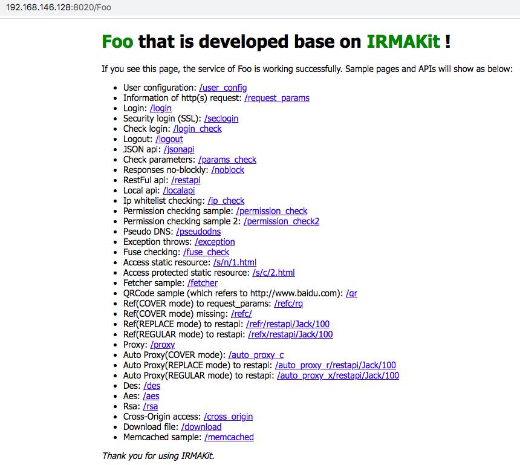

# IRMA

IRMA源于一次企业项目，综合各种原因和考虑而孵化出IRMA（例如企业与微软战略合作、.Net研发团队、公有云部署、SaaS化服务、自动化部署、采用Linux环境、高效的请求响应等）。IRMA本质上是一个基于Mono、FastCGI的高效的.Net Web Service开发框架，总体分为两部分：底层采用C语言实现的多线程工作调度引擎`irmacall`、及C#实现的开发框架`irmakit`。其核心设计理念为：“***简单高效调度、按需集成扩展***”，这也是为何IRMA既像一个框架、实际更是一个工具集的原因。理论上`irmacall`的设计可支持和调度其他语言所构建的类`irmakit`框架，而不只是.Net系列的语言。关于.Net开发项目运行在Linux环境，既可以考虑目前已相当成熟的.Net Core，Mono也是一个非常具有历史沉淀的考虑，IRMA是后者的一种选择实现，借助Mono实现语言层面的解析执行、采用FastCGI处理HTTP相关网络交互，最后结合Nginx实现高效请求代理与项目路由分发。

## 编译安装

`irmacall`引擎依赖于若干开源开发库，首先先完成必要的依赖包配置、及所希望的功能特性支持：

```bash
$ make config
```

以个人开发环境为例，相关依赖包均以免版本信息方式（`--prefix`参数中没有带版本信息、或`ln -s`软链文件方式）默认部署在：`$HOME/local/`，上述配置过程将大概如下（直接回车将按默认配置，否则可自行修改）：

```bash
########################################
# mono config:
########################################
mono installed location ? [/home/fenkey/local/mono]

########################################
# ssl config:
########################################
ssl installed location ? [/home/fenkey/local/openssl]

########################################
# fcgi config:
########################################
fcgi installed location ? [/home/fenkey/local/fcgi]

########################################
# curl config:
########################################
curl installed location ? [/home/fenkey/local/curl]
c_ares support ? [y]
c_ares installed location ? [/home/fenkey/local/c-ares]

########################################
# memcached config:
########################################
memcached support ? [y]
memcached installed location ? [/home/fenkey/local/libmemcached]

########################################
# redis config:
########################################
redis support ? [y]
hiredis installed location ? [/home/fenkey/local/hiredis]

########################################
# smtp config:
########################################
smtp support ? [y]

The irma is now hopefully configured for your setup.
Check the config.in & config.h files and do 'make' to build it.
```

上述依赖包参考地址如下：

* `mono`: <a src="https://github.com/mono/mono.git">https://github.com/mono/mono.git</a>
* `openssl`: <a src="https://github.com/openssl/openssl.git">https://github.com/openssl/openssl.git</a>
* `fcgi`: <a src="http://fastcgi.com/">http://fastcgi.com/</a> or <a src="https://github.com/jorben/fcgi">https://github.com/jorben/fcgi</a>
* `c-ares`: <a src="https://github.com/c-ares/c-ares">https://github.com/c-ares/c-ares</a>
* `curl`: <a src="https://github.com/curl/curl.git">https://github.com/curl/curl.git</a>
* `memcached`: <a src="https://libmemcached.org/">https://libmemcached.org/</a>
* `hiredis`: <a src="https://github.com/redis/hiredis.git">https://github.com/redis/hiredis.git</a>

> 在编译libcurl时，留意加入SSL支持（`--with-ssl`）；同时libcurl本身不支持异步DNS解析（`irmacall`内`fetcher`组件内会涉及到DNS解析处理），解决的方案既可以通过`signal`方式、也可通过第三方的`c-ares`方式，前者结合Mono及多线程情况，会有潜在不稳定风险，理想的做法是按libcurl官方建议采用`c-ares`，故结合上述情况，先完成`c-ares`的编译安装：

```bash
$ ./configure --prefix=$HOME/local/c-ares --enable-static
$ make
$ make install
```

> 然后编译安装libcurl：

```bash
$ ./buildconf
$ export PKG_CONFIG_PATH=$HOME/local/openssl/lib/pkgconfig
$ ./configure --prefix=$HOME/local/curl --disable-ldap --disable-ldaps --with-ssl --enable-ares=$HOME/local/c-ares --enable-static
$ make
$ make install
```

完成上述IRMA配置后，按提示在当前目录下将生成两个文件：`config.in`、`config.h`，如果确定没有修改地方，则继续对IRMA进行整体编译和安装：

```bash
$ make
$ make install
```

默认安装地址为：`$HOME/local/irma`，修改请编辑`irma/Makefile`文件内配置：

```bash
PREFIX = $(HOME)/local/irma
```

设置必要的命令查询路径（本处仅示范，建议vim打开编辑）：

```bash
$ echo "export PATH=$HOME/local/irma/bin:$PATH" >> ~/.bash_profile
$ . ~/.bash_profile
```

执行检查：

```bash
$ irmacall
 ___ ____  __  __    _    ____      _ _
|_ _|  _ \|  \/  |  / \  / ___|__ _| | |
 | || |_) | |\/| | / _ \| |   / _` | | |
 | ||  _ <| |  | |/ ___ \ |__| (_| | | |
|___|_| \_\_|  |_/_/   \_\____\__,_|_|_|
+------------------------------------------------------------------------------------------------------------------+
| Usage: irmacall [-t <log-type>] [-x <thread-count>] [-m <module-invoke>] [-c <config-of-module>] [-k] [-v] [-h]  |
| Options:                                                                                                         |
|    -t: Log lever of 'debug', 'event', 'warn', 'error' or 'fatal'                                                 |
|    -x: Threads count of every process                                                                            |
|    -m: Module invoking. Normally, it's a .Net DLL                                                                |
|    -c: Configuration file of module                                                                              |
|    -k: Mock request support                                                                                      |
|    -v: Version of irmacall                                                                                       |
|    -h: Help information                                                                                          |
+------------------------------------------------------------------------------------------------------------------+

$ irmacall -v
irmacall 0.8
Features: fetcher fuse c_ares memcached redis smtp
```

## 项目示例

简单快速创建并启动您的第一个Web Service项目（例如`Foo`项目）：

```bash
$ cd ~/tmp
$ irma-genapp Foo
Generated project: 'Foo'. Check pls !

$ cd Foo
$ make
...
$ ./start.sh
spawn-fcgi: child spawned successfully: PID: 17701
```

> 由于IRMA所生成的项目，在Linux环境下采用`Nginx + FastCGI`方式运行，其启动采用常规的`spawn-fcgi`命令启动，故需要额外安装：

```bash
$ git clone https://github.com/lighttpd/spawn-fcgi
$ cd spawn-fcgi
$ ./autogen.sh
$ ./configure --prefix=$HOME/local/spawn-fcgi
$ make
$ make install
$ echo "export PATH=$HOME/local/spawn-fcgi/bin:$PATH" >> ~/.bash_profile
$ . ~/.bash_profile
```

`Foo`将以多进程/多线程方式被启动、并以`debug`方式输出日志（`Bin/Debug/log/`目录），可根据实际情况修改`start.sh`文件内相关配置（其中`thread_count`是指单个进程内线程数量）：

```bash
process_count=1
thread_count=4
log_type="debug"
...
```

如果`Foo`启动失败，可能是因为Sample内将按配置进行了`Memcached`连接失败而导致（参考启动配置文件`conf/Foo.conf`内`system.session.server.servers`及`user.mc`配置），请确保已按配置启动了`Memcached Server`或`Web/MyService.cs`内屏蔽相关代码。例如：

```bash
$ ./start.sh
!!!!!!!!!!!!!
!!! FATAL !!! - Fail to launch project 'Foo.dll' ! check log files pls
!!!!!!!!!!!!!

$ cat Bin/Debug/log/fatal/irma_20200903.log
[14:46:15,554039|032126|7f4d19fa7700] Kit - Service init failed: Memcached client instance is null: Availability testing is failed
[14:46:15,554132|032126|7f4d19fa7700] Core - Raise exception while invoking application ! Check it pls
```

如果是其他原因，请参考[FAQ](./docs/FAQ.zh-CN.md)内相关描述。成功启动情况下，将会产生有效`log`文件。例如：

```bash
$ cat Bin/Debug/log/event/irma_20200903.log
[15:01:38,147495|032299|7f017783e780] Core - irmacall version(0.8)
[15:01:38,601612|032299|7f0173da6700] Kit - Service start
[15:01:38,688583|032299|7f0171e83700] Kit - Service start
[15:01:38,787017|032299|7f01710ff700] Kit - Service start
[15:01:38,875054|032299|7f017783e780] Core - Total (4) workers have been booted up successfully
[15:01:38,875149|032299|7f0153fff700] Kit - Service start
```

配置Nginx（前提需要先安装Nginx），并确保配置后Nginx reload或restart：

```bash
server {
	listen 8020;
	server_name localhost;
	
	...
	
	location ~ ^/Foo(/|$) {
		fastcgi_pass unix:/home/fenkey/tmp/Foo/Bin/Debug/irma.sock;
		include nginx_fastcgi.conf;
    }
}
```

> 其中`nginx_fastcgi.conf`文件用于描述Nginx与FastCGI之间`HTTP`请求参数映射关系，例如：

```bash
fastcgi_param  SERVER_NAME      $server_name;
fastcgi_param  SERVER_ADDR      $server_addr;
fastcgi_param  SERVER_PORT      $server_port;
fastcgi_param  SERVER_PROTOCOL  $server_protocol;
fastcgi_param  REMOTE_ADDR      $remote_addr;
fastcgi_param  REMOTE_PORT      $remote_port;
fastcgi_param  DOCUMENT_ROOT    $document_root;
fastcgi_param  SCRIPT_FILENAME  $document_root$fastcgi_script_name;
fastcgi_param  REQUEST_URI      $request_uri;
fastcgi_param  QUERY_STRING     $query_string;
fastcgi_param  REQUEST_METHOD   $request_method;
fastcgi_param  CONTENT_TYPE     $content_type;
fastcgi_param  CONTENT_LENGTH   $content_length;
```

访问验证，打开浏览器并输入访问地址：


## FAQ

更多使用方法、设计考虑及其他细节疑问等，请参考：[FAQ](./docs/FAQ.zh-CN.md)

结合上述简单示例及IRMA源代码，相信您一定能快速、深入了解和应用IRMA ！


## 贡献

欢迎您以各种方式加入，例如提交您的代码、文档、提问或解答！
